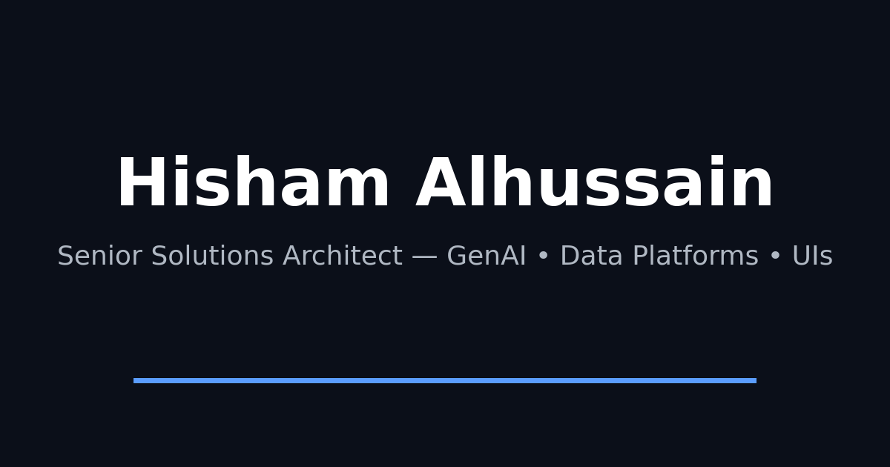

<div align="center">

# Hisham Alhussain

**Senior Solutions Architect · GenAI Assistants · AI/ML Products · Data Platforms**

[](https://www.hisham-alhussain.dev)
[](https://nextjs.org)
[](https://www.typescriptlang.org)
[](https://tailwindcss.com)



</div>

<br />

A fast, dark-themed personal portfolio and blog built with **Next.js (App Router)**, **TypeScript**, **Tailwind CSS**, **shadcn/ui**, and **Framer Motion** — tuned for clean SEO, subtle motion, and near-perfect performance scores.

## ✨ Features

| | |
|---|---|
| 🎨 **Dark-first UI** | Polished dark theme by default with a light/dark toggle (`next-themes`) |
| 🧠 **GitHub highlights** | Lazy-loaded "Open Source Highlights" pulled live from the GitHub API |
| ✍️ **Blog** | File-based posts with dynamic routes, plus an auto-generated `/feed.xml` |
| 🔍 **SEO baked in** | `metadata` API, `robots.txt`, `sitemap.xml`, and Open Graph / Twitter card images |
| 🎬 **Motion, done right** | Framer Motion animations that respect `prefers-reduced-motion` |
| ⚡ **Performance tuned** | Preconnects, lazy loading, optimized `lucide-react` imports, modern browser targets |
| ♿ **Accessible** | Keyboard-friendly navigation and semantic markup throughout |

## 🛠 Tech Stack

- **Framework** — [Next.js 15](https://nextjs.org) (App Router)
- **Language** — TypeScript
- **UI** — Tailwind CSS, [shadcn/ui](https://ui.shadcn.com), [lucide-react](https://lucide.dev)
- **Animation** — [Framer Motion](https://www.framer.com/motion)
- **Theming** — [next-themes](https://github.com/pacocoursey/next-themes)
- **Analytics** — Vercel Analytics
- **Hosting** — Vercel

## 📂 Project Structure

```
src/
├─ app/              # Routes (App Router): home, blog, feed, sitemap, robots, OG image
├─ components/ui/    # Reusable UI primitives (button, card, badge, theme toggle, ...)
├─ content/          # Blog post data
└─ lib/              # Shared utilities
```

## 🚀 Getting Started

**Prerequisites:** Node.js 18–22 and npm (or pnpm/yarn)

```bash
git clone https://github.com/hisham8383/hisham-portfolio.git
cd hisham-portfolio
npm install
npm run dev
```

Open [http://localhost:3000](http://localhost:3000) to view it locally.

### Scripts

| Command | Description |
|---|---|
| `npm run dev` | Start the dev server (Turbopack) |
| `npm run build` | Build for production |
| `npm run start` | Run the production build |
| `npm run lint` | Lint the codebase |

## 📄 License

Personal portfolio source — feel free to browse for inspiration, but please don't redeploy it as your own.

---

<div align="center">

**[hisham-alhussain.com](https://www.hisham-alhussain.com)**

</div>
